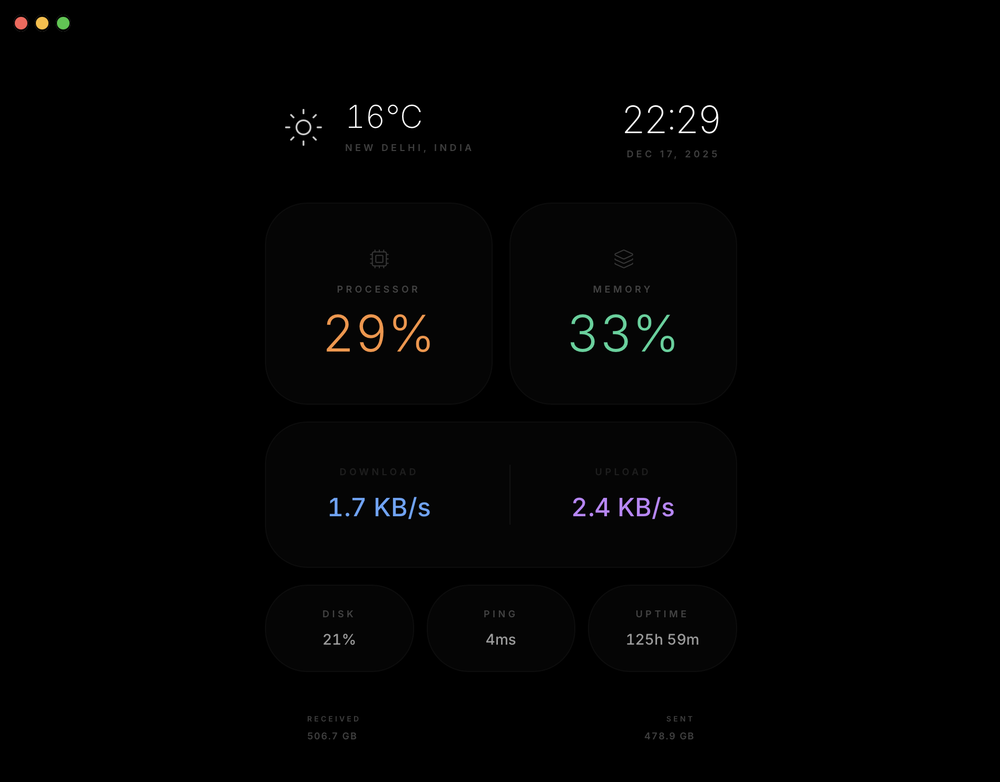

# Ether

A lightweight, self-hosted system monitor with a dark AMOLED-style interface.
Shows real-time system stats, network activity, uptime, ping, and local weather in a single web dashboard.



## Features

- Live CPU, memory, disk usage
- Network upload / download speed
- Total data sent / received
- System uptime and ping
- Local weather with auto-location
- Clean, minimal AMOLED-friendly UI
- Docker-ready

## Stack

- FastAPI
- psutil
- Open-Meteo + OpenStreetMap
- Tailwind CSS + Lucide Icons

## Usage

### Docker Compose

```bash
docker compose up -d
